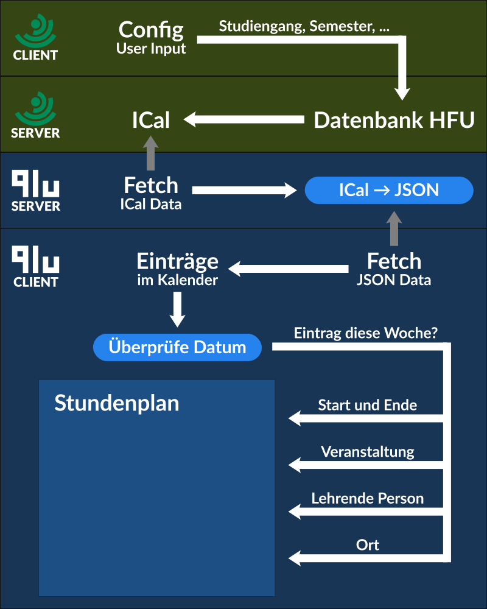

# HFU Stundenplan
**Kleines Nebenprojekt: Es ist der HFU Stundenplan, aber er sieht schöner aus.** 
_Weil mir der Alte mit seinem längst veralteten Design zum Hals raus hing_

Zeigt bei Aufruf die aktuelle Woche, es kann dann durch die vergangenen und kommenden Wochen geklickt werden. 
Ursprünglich nur für mich selbst gemacht aber ist jetzt auch public.  
Alles sehr hacky, aber es funktioniert, also was solls.

## Erreichbar unter [hfu.qlulezz.de](https://hfu.qlulezz.de/)

Bug Reports, Feature Requests, Feedback: immer her damit!

## Features
- Laden der Daten über ICal
- Einfaches Klicken durch vergangene und kommende Wochen
- Individuell einstellbare Farben
- Speichern der Konfiguration im LocalStorage
- Direkte Links zu Alfaview Räumen
- Schnelles Laden aufgrund wenig Code und eigener API

## Geplante Features:
- Optimieren für Mobile
- Gleichzeitig laufende Veranstaltungen zeigen
- Mehrere Studiengänge im gleichen Stundenplan
- Feiertage?

Weitere Ideen oder Wünsche können mir auch direkt per Discord ([qlulezz#2946](https://discordapp.com/users/263272950700965888/)) mitgeteilt werden.

## How It Works:

